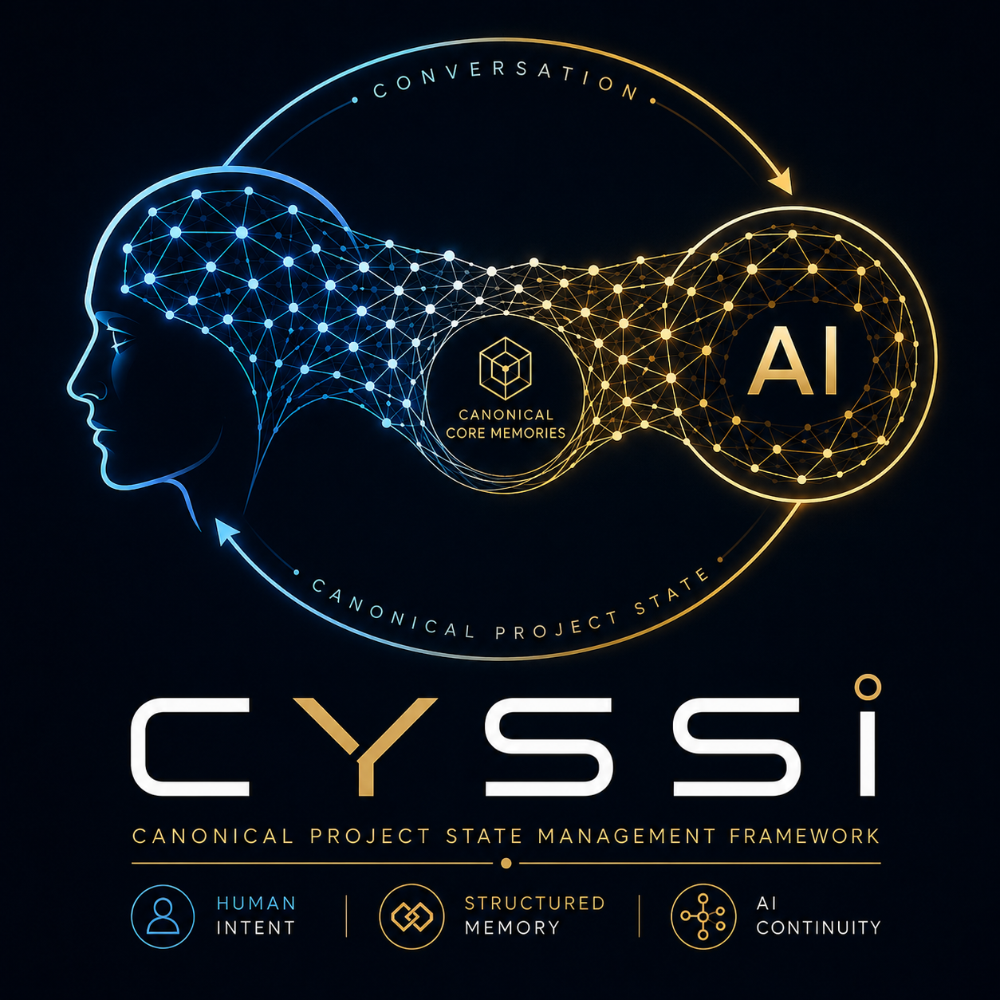

<h1 align="center">CYSSI Framework</h1>

<b>Canonical Project State Management Framework</b>

<i>The chat is temporary. 
The project state is forever.</i>

---

Why CYSSI?

Large Language Models are excellent at reasoning.

They are not designed to preserve a long-term project state across independent conversations.

As projects grow over days, weeks or months, information gradually drifts.

Typical consequences are:

* Forgotten decisions
* Different assumptions
* Inconsistent documentation
* Conflicting diagrams
* Missing project constraints
* Repeated explanations
* Loss of canonical knowledge

Most AI workflows attempt to reconstruct a project from previous conversations.

CYSSI takes a different approach.

Instead of making the conversation the source of truth, CYSSI introduces a canonical project state that survives every chat, every session and every supported AI model.

⸻

The Core Principle

The conversation transports knowledge.

The snapshot preserves knowledge.

The project—not the conversation—is the single authoritative source of truth.

⸻

Architecture

                 Human
                    │
                    ▼
             Conversation
                    │
                    ▼
          Conversation Compiler
                    │
      ┌─────────────┴─────────────┐
      │                           │
Directive Processing        Information Extraction
      │                           │
      └─────────────┬─────────────┘
                    ▼
               Validation
                    │
                    ▼
            Canonicalization
                    │
                    ▼
        Canonical Project State
                    │
                    ▼
             Snapshot (S000x)
                    │
                    ▼
          Next Conversation

⸻

Philosophy

CYSSI is built around a simple observation:

AI models reconstruct conversations.

CYSSI reproduces projects.

This distinction is the foundation of the framework.

⸻

Core Components

Component	Purpose
Context Bubble	Defines the active working context
Project Contract	Defines immutable project rules
Locked Facts	Canonical project constants
Conversation Compiler	Extracts structured knowledge
CYSSI Directive Language (CDL)	Explicit project control
Semantic Compression	Compresses without losing meaning
Context Snapshot	Canonical project representation
Conversation Lifecycle	Defines the project workflow

⸻

CYSSI Directive Language (CDL)

The Directive Language allows users to explicitly modify the project state.

Examples:

@lock project.name = CYSSI
@decision Chat is not memory.
@rename FrameworkX -> CYSSI
@forget Chapter 4
@snapshot

Directives always have higher priority than conversational inference.

⸻

Example Snapshot

snapshot:
  id: S0001
  version: 1.0
project:
  name: Example Project
locked_facts:
  - Python is the primary programming language.
  - PostgreSQL is mandatory.
decision_log:
  - id: D0001
    decision: Git is used as version control.

⸻

Project Workflow

Create Project
      │
      ▼
Create Initial Snapshot
      │
      ▼
Work with AI
      │
      ▼
Lock Facts
      │
      ▼
Record Decisions
      │
      ▼
Generate Snapshot
      │
      ▼
Start New Conversation
      │
      ▼
Load Snapshot

Repeat indefinitely.

⸻

Repository Structure

CYSSI/
├── README.md
├── LICENSE
├── CONTRIBUTING.md
│
├── docs/
│   ├── Introduction.md
│   ├── Architecture.md
│   ├── Project_Contract.md
│   ├── CDL.md
│   ├── Snapshots.md
│   ├── Best_Practices.md
│   └── FAQ.md
│
├── examples/
│   ├── example_snapshot.yaml
│   └── hello_cyssi/
│
└── schema/
    ├── snapshot.schema.json
    └── snapshot.schema.yaml

⸻

Roadmap

Completed

* ✅ Core Concept
* ✅ Project Contract
* ✅ Snapshot Architecture
* ✅ Locked Facts
* ✅ Conversation Lifecycle
* ✅ CYSSI Directive Language
* ✅ Brand Identity
* ✅ GitHub Documentation

Planned

* ⬜ Snapshot Schema
* ⬜ Context Diff
* ⬜ Snapshot Merge
* ⬜ Semantic Compression Specification
* ⬜ Reference Parser
* ⬜ CLI
* ⬜ VSCode Extension
* ⬜ SDK

⸻

Design Philosophy

CYSSI follows six fundamental principles:

* Canonical before conversational
* Deterministic before creative
* Reproduce before reconstruct
* Explicit before implicit
* Human-readable and machine-readable
* Model independent

⸻

Project Status

Current Status

Public Pre-Release

Current Version

0.6.0

⸻

Contributing

Contributions are welcome.

Ideas, implementations, documentation improvements and discussions are encouraged.

Please read the documentation before submitting changes.

⸻

License

This project is licensed under the GNU General Public License v3.0 (GPL-3.0).

⸻

Vision

CYSSI aims to become a universal, model-independent standard for persistent collaboration between humans and AI systems.

The goal is not to preserve conversations.

The goal is to preserve projects.

⸻

⭐ Remember

Conversations disappear.

Projects shouldn’t.

