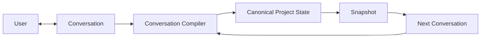
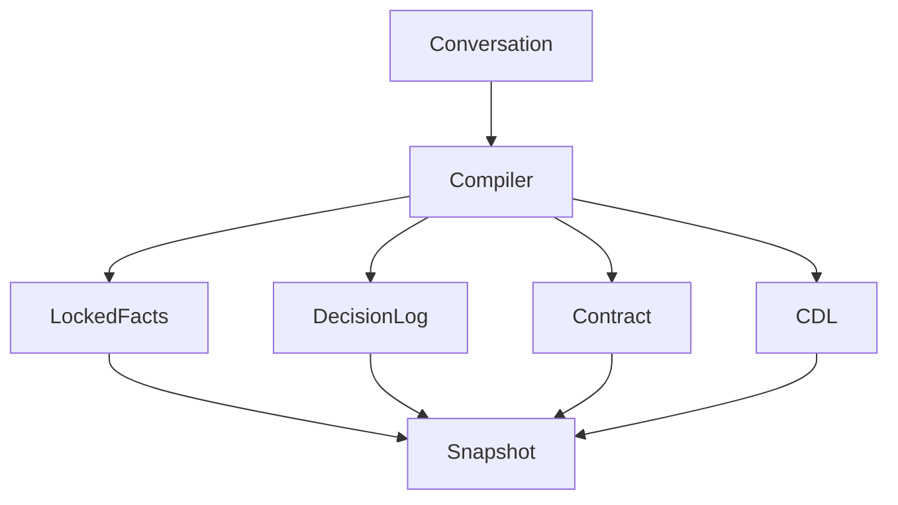
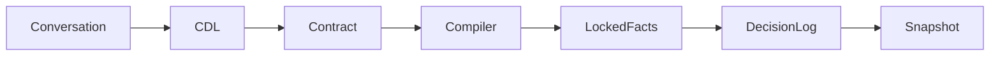

# Architecture

CYSSI is built around a simple but powerful idea:

> **The project state is permanent. Conversations are temporary.**

Rather than reconstructing knowledge from previous conversations, every AI interaction begins by restoring a canonical project state.

The framework itself is intentionally modular. Every component has a clearly defined responsibility and communicates only through the project state.

---

# High-Level Architecture



The snapshot is the only persistent artifact.

Everything else is temporary.

---

# Core Components

The framework consists of several independent components.

| Component | Responsibility |
|-----------|----------------|
| Conversation | Communication between user and AI |
| Conversation Compiler | Extracts relevant information from the conversation |
| Project Contract | Defines immutable framework behaviour |
| Locked Facts | Stores canonical project constants |
| Decision Log | Records explicit project decisions |
| CDL | Executes explicit user directives |
| Snapshot Generator | Produces the next canonical project state |

---

# Component Overview



---

# Conversation

The conversation is a transport medium.

It provides information but does not permanently store project knowledge.

A conversation may end at any time without affecting the project.

---

# Conversation Compiler

The Conversation Compiler is responsible for transforming communication into structured project information.

Its responsibilities include:

- extracting relevant information
- ignoring conversational noise
- detecting decisions
- identifying locked facts
- applying directives
- updating the project state

The compiler never invents project knowledge.

---

# Project Contract

The Project Contract defines global framework behaviour.

Typical examples include:

- chat is not memory
- project state is canonical
- deterministic processing
- explicit decisions only

Every implementation evaluates the contract before processing the remaining snapshot.

---

# Locked Facts

Locked Facts describe immutable project knowledge.

Examples include:

- project name
- repository layout
- framework principles
- architectural invariants

Locked Facts may only change through explicit user intent.

---

# CYSSI Directive Language

The CYSSI Directive Language (CDL) allows users to issue deterministic instructions.

Examples:

```text
@lock
@decision
@snapshot
@rename
@forget
```

Directives always have priority over conversational interpretation.

---

# Decision Log

The Decision Log stores explicit project decisions.

Unlike conversations, decisions become part of the canonical project state.

Every important architectural change should be recorded.

---

# Snapshot

The snapshot is the central artifact of CYSSI.

It represents the complete project state at a specific point in time.

Every new conversation begins by loading the latest snapshot.

---

# Processing Pipeline



---

# Design Principles

Every component follows the same principles.

## Deterministic

The same snapshot always produces the same project state.

---

## Explicit

No hidden knowledge exists.

All important information is stored in the snapshot.

---

## Modular

Components have clearly separated responsibilities.

Future framework versions may replace individual components without changing the overall architecture.

---

## Model Independent

The architecture is independent of any AI provider.

Only the snapshot format and specifications are required.

---

# Repository Integration

The architecture is reflected in the repository structure.

```text
docs/
specs/
schema/
examples/
```

Documentation explains the framework.

Specifications define the framework.

Schemas validate the framework.

Examples demonstrate the framework.

---

# Summary

CYSSI separates communication from knowledge.

Conversations transport information.

Snapshots preserve information.

This distinction enables reproducible, deterministic and model-independent collaboration between humans and AI systems.