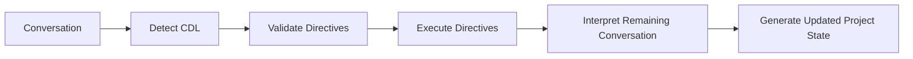

# CYSSI Directive Language (CDL)

The CYSSI Directive Language (CDL) is a lightweight, deterministic command language used to manipulate the canonical project state.

Unlike natural language, CDL directives are never interpreted heuristically. Their syntax and semantics are defined by the CYSSI specification and therefore produce identical results across all compliant implementations.

---

# Purpose

CDL exists to eliminate ambiguity.

Natural language is ideal for discussion and reasoning.

CDL is intended for actions that must deterministically modify the canonical project state.

---

# Design Principles

## Explicit

Every directive expresses exactly one intention.

---

## Deterministic

The same directive always produces the same result.

---

## Human Readable

Directives are simple enough to be written manually.

---

## Machine Readable

Directives can be parsed without AI-specific interpretation.

---

## Reversible

Every state-changing directive should be reversible whenever possible.

The framework must preserve enough history to restore previous project states.

---

# Processing Order



CDL directives always execute before conversational interpretation.

---

# General Syntax

Every directive begins with the `@` character.

```text
@directive <path> <arguments>
```

Example

```text
@set project.name "CYSSI"
```

---

# Directive Categories

The directive language is organized into four functional groups.

- State Operations
- Snapshot Management
- History & Comparison
- Transactions

---

# State Operations

State operations manipulate the canonical project state directly.

All operations use simple dot notation to address snapshot elements.

## Set

```text
@set <path> <value>
```

Sets or updates a value.

Example

```text
@set project.version "0.15.0"

@set branding.slogan "The chat is temporary."
```

---

## Unset

```text
@unset <path>
```

Removes a value.

Example

```text
@unset branding.slogan
```

---

## Add

```text
@add <path> <value>
```

Adds an element to a collection.

Examples

```text
@add locked_facts "The framework name is CYSSI."

@add components "Snapshot Validator"

@add documentation.completed "docs/CDL.md"
```

---

## Remove

```text
@remove <path> <value>
```

Removes an element from a collection.

Examples

```text
@remove locked_facts "The framework name is FRUDEK."

@remove documentation.pending "docs/CDL.md"
```

---

## Replace

```text
@replace <path> <old> <new>
```

Atomically replaces one value with another.

Example

```text
@replace project.name
"Framework-FRUDEK"
"CYSSI"
```

---

## Move

```text
@move <source> <destination> <value>
```

Moves an element between collections.

Example

```text
@move documentation.pending documentation.completed "docs/CDL.md"
```

---

## Rename

```text
@rename <path> <new-value>
```

Renames a value.

Example

```text
@rename project.name "CYSSI"
```

---

# Snapshot Management

## Generate Snapshot

```text
@snapshot
```

Generates a new canonical snapshot.

---

## Restore Snapshot

```text
@restore S0012
```

Restores a previously generated snapshot.

---

## Rollback

```text
@rollback
```

Restores the immediately preceding snapshot.

---

## Rollback to Specific Snapshot

```text
@rollback S0010
```

Restores an arbitrary earlier snapshot.

---

# History & Comparison

## History

```text
@history
```

Displays the snapshot history.

---

## Diff

```text
@diff S0012 S0013
```

Displays semantic differences between two snapshots.

---

## Merge

```text
@merge S0010 S0012
```

Creates a merged project state.

Conflict resolution is implementation-specific unless otherwise defined by the Snapshot Merge specification.

---

# Transactions

Transactions allow multiple directives to be executed atomically.

---

## Begin Transaction

```text
@begin
```

Starts a transaction.

---

## Commit Transaction

```text
@commit
```

Applies every queued modification.

---

## Abort Transaction

```text
@abort
```

Cancels the transaction.

No queued changes become part of the project state.

---

# Processing Rules

A compliant implementation must:

1. Detect CDL directives.
2. Validate syntax.
3. Validate semantic correctness.
4. Execute directives in order.
5. Update the canonical project state.
6. Continue conversational processing.

---

# Error Handling

Unknown directives must never terminate processing.

Instead, an implementation should:

- report the error,
- ignore the invalid directive,
- continue processing remaining directives.

---

# Priority

Directive execution has higher priority than conversational interpretation.

Whenever a conflict exists, the directive always wins.

---

# Relationship to Other Components

CDL interacts directly with:

- Project Contract
- Locked Facts
- Decision Log
- Snapshot Generator
- Snapshot Specification

Natural conversation remains available for discussion and reasoning.

CDL exists exclusively for deterministic state management.

---

# Extensibility

Future versions of CDL may introduce additional operations while preserving backwards compatibility with the existing instruction set.

---

# Summary

The CYSSI Directive Language is the deterministic control interface of the CYSSI Framework.

It separates explicit project management from natural conversation and enables reproducible, reversible and model-independent manipulation of the canonical project state.

By defining a minimal, orthogonal instruction set based on generic state operations, CDL remains simple, consistent and implementation-independent while supporting long-term Human-AI collaboration through deterministic project state management.