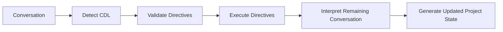

# CYSSI Directive Language (CDL)

The CYSSI Directive Language (CDL) is a lightweight, deterministic command language used to manipulate the canonical project state.

Unlike natural language, CDL directives are never interpreted heuristically. Their syntax and semantics are defined by the CYSSI specification and therefore produce identical results across all compliant implementations.

---

# Purpose

CDL exists to eliminate ambiguity.

Natural language is ideal for discussion and reasoning.

CDL is intended for actions that must deterministically modify the canonical project state.

---

# Design Principles

## Explicit

Every directive expresses exactly one intention.

---

## Deterministic

The same directive always produces the same result.

---

## Human Readable

Directives are simple enough to be written manually.

---

## Machine Readable

Directives can be parsed without AI-specific interpretation.

---

## Reversible

Every state-changing directive should be reversible whenever possible.

The framework must preserve enough history to restore previous project states.

---

# Processing Order



CDL directives always execute before conversational interpretation.

---

# General Syntax

Every directive begins with the `@` character.

```text
@directive arguments
```

Example

```text
@lock The framework name is CYSSI.
```

---

# Directive Categories

The directive language is organized into six functional groups.

- Snapshot Management
- State Management
- Facts & Decisions
- Repository & Documentation
- History & Comparison
- Transactions

---

# Snapshot Management

## Generate Snapshot

```text
@snapshot
```

Generates a new canonical snapshot.

---

## Restore Snapshot

```text
@restore S0012
```

Restores a previously generated snapshot.

---

## Rollback

```text
@rollback
```

Restores the immediately preceding snapshot.

---

## Rollback to Specific Snapshot

```text
@rollback S0010
```

Restores an arbitrary earlier snapshot.

---

# State Management

## Generic Setter

```text
@set project.version 0.14.0
```

Sets or updates any mutable field.

---

## Remove Field

```text
@unset project.experimental
```

Removes a mutable field from the project state.

---

# Facts & Decisions

## Locked Fact

```text
@lock
```

Creates a Locked Fact.

Example

```text
@lock The framework name is CYSSI.
```

---

## Remove Locked Fact

```text
@unlock
```

Removes a Locked Fact.

Example

```text
@unlock The framework name is FRUDEK.
```

---

## Replace Locked Fact

```text
@replace-lock
Old: The framework name is FRUDEK.
New: The framework name is CYSSI.
```

Atomically replaces one Locked Fact with another.

---

## Project Fact

```text
@fact
```

Creates a mutable project fact.

---

## Remove Project Fact

```text
@revert-fact
```

Removes an existing project fact.

---

## Replace Project Fact

```text
@replace-fact
```

Updates a project fact.

---

## Decision

```text
@decision
```

Creates a Decision Log entry.

---

## Revert Decision

```text
@revert-decision D0014
```

Marks a decision as reverted.

The original entry remains part of project history.

---

## Supersede Decision

```text
@supersede D0014
```

Replaces an existing decision with a newer one.

The historical relationship is preserved.

---

# Repository & Documentation

## Repository

```text
@repository add docs/API.md
```

Adds an artifact.

```text
@repository remove docs/API.md
```

Removes an artifact.

```text
@repository rename
```

Renames an artifact.

---

## Components

```text
@component add
```

Adds a framework component.

```text
@component remove
```

Removes a component.

```text
@component rename
```

Renames a component.

---

## Documentation

```text
@doc complete docs/CDL.md
```

Marks documentation as completed.

```text
@doc pending docs/Snapshots.md
```

Moves documentation back into the pending list.

```text
@doc remove docs/Old.md
```

Removes obsolete documentation.

---

# History & Comparison

## History

```text
@history
```

Displays the snapshot history.

---

## Diff

```text
@diff S0012 S0013
```

Displays semantic differences between two snapshots.

---

## Merge

```text
@merge S0010 S0012
```

Creates a merged project state.

Conflict resolution is implementation-specific unless otherwise defined by the Snapshot Merge specification.

---

# Transactions

Transactions allow multiple directives to be executed atomically.

---

## Begin Transaction

```text
@begin
```

Starts a transaction.

---

## Commit Transaction

```text
@commit
```

Applies every queued modification.

---

## Abort Transaction

```text
@abort
```

Cancels the transaction.

No queued changes become part of the project state.

---

# Processing Rules

A compliant implementation must:

1. Detect CDL directives.
2. Validate syntax.
3. Validate semantic correctness.
4. Execute directives in order.
5. Update the canonical project state.
6. Continue conversational processing.

---

# Error Handling

Unknown directives must never terminate processing.

Instead, an implementation should:

- report the error,
- ignore the invalid directive,
- continue processing remaining directives.

---

# Priority

Directive execution has higher priority than conversational interpretation.

Whenever a conflict exists, the directive always wins.

---

# Relationship to Other Components

CDL interacts directly with:

- Project Contract
- Locked Facts
- Decision Log
- Snapshot Generator
- Snapshot Specification

Natural conversation remains available for discussion and reasoning.

CDL exists exclusively for deterministic state management.

---

# Extensibility

Future versions of CYSSI may introduce additional directives.

Existing directives should preserve backwards compatibility whenever possible.

Unknown directives must be ignored by older implementations.

---

# Summary

The CYSSI Directive Language is the deterministic control interface of the CYSSI Framework.

It separates explicit project management from natural conversation and enables reproducible, reversible and model-independent manipulation of the canonical project state.

By introducing state management, rollback capabilities, history navigation and transactional processing, CDL evolves from a simple command language into a complete **Project State Management Language (PSML)** for long-term Human-AI collaboration.