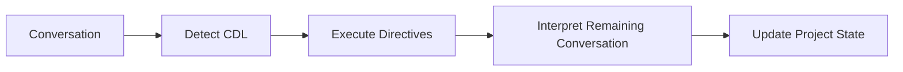

# CYSSI Directive Language (CDL)

The CYSSI Directive Language (CDL) is a lightweight command language that allows users to issue explicit, deterministic instructions to a CYSSI implementation.

Unlike natural language, CDL directives are never interpreted heuristically.

Their meaning is defined by the CYSSI specification and must be processed identically by every compliant implementation.

---

# Purpose

CDL exists to eliminate ambiguity.

Natural language is well suited for discussion.

Directives are intended for actions that must become canonical project state.

---

# Design Principles

CDL follows four principles.

## Explicit

Every directive expresses exactly one intention.

---

## Deterministic

A directive always produces the same result.

No interpretation is required.

---

## Human Readable

Directives are simple enough to be written manually.

---

## Machine Readable

Every directive can be parsed without relying on language models.

---

# Processing Order

Directives are evaluated before conversational interpretation.



---

# Directive Syntax

Every directive begins with the `@` symbol.

General syntax:

```text
@directive arguments
```

Example:

```text
@lock The framework name is CYSSI.
```

---

# Available Directives

## @lock

Creates or updates a Locked Fact.

Example:

```text
@lock The framework name is CYSSI.
```

---

## @decision

Creates a Decision Log entry.

Example:

```text
@decision Repository structure becomes canonical.
```

---

## @rename

Renames an existing object.

Example:

```text
@rename Framework-FRUDEK CYSSI
```

---

## @forget

Removes information from the canonical project state.

Example:

```text
@forget Temporary brainstorming notes.
```

---

## @snapshot

Requests generation of a new snapshot.

Example:

```text
@snapshot
```

---

# Processing Rules

A compliant implementation must:

1. Detect directives.
2. Validate syntax.
3. Execute directives.
4. Update the project state.
5. Continue normal conversation processing.

---

# Error Handling

Unknown directives must not terminate processing.

Instead they should:

- report an error
- ignore the directive
- continue processing

---

# Priority

Directive execution has higher priority than conversational interpretation.

When both produce conflicting results, the directive always wins.

---

# Relationship to Other Components

CDL interacts with:

- Project Contract
- Locked Facts
- Decision Log
- Snapshot Generator

It does not replace natural conversation.

Instead, it provides deterministic control over the canonical project state.

---

# Extensibility

Future versions of CYSSI may introduce additional directives.

Existing directives should preserve their behaviour whenever possible.

---

# Summary

The CYSSI Directive Language provides a deterministic interface between human intent and the canonical project state.

By separating explicit commands from natural language, CDL enables reproducible project management across conversations, AI models and software implementations.