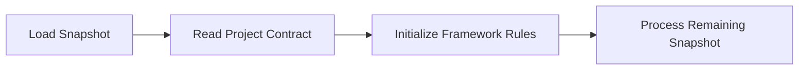

# Project Contract

The Project Contract defines the immutable behavioural rules of a CYSSI project.

Unlike project documentation, the Project Contract does not describe the project itself. Instead, it specifies **how every compliant implementation must behave** when processing a snapshot.

The Project Contract is the first executable component of every CYSSI snapshot and is evaluated before any other project information.

---

# Purpose

The purpose of the Project Contract is to guarantee deterministic behaviour across:

- AI models
- Software implementations
- Operating systems
- Programming languages
- Future framework versions

Every implementation that follows the Project Contract will interpret the same snapshot consistently.

---

# Design Principles

The Project Contract is built upon four fundamental principles.

## Explicit

Framework behaviour is never inferred.

Every behavioural rule is declared explicitly inside the snapshot.

---

## Deterministic

Given the same snapshot, every compliant implementation must produce the same project state.

No hidden memory or implicit assumptions are permitted.

---

## Immutable During Processing

The Project Contract remains fixed for the entire processing cycle.

Changes become effective only after a new snapshot has been generated and loaded.

---

## Canonical

The Project Contract is part of the canonical project state.

It is therefore subject to version control together with the snapshot.

---

# Processing Order

The Project Contract is evaluated immediately after loading a snapshot.



No component may execute before the Project Contract has been processed.

---

# Contract Rules

The current CYSSI Project Contract defines the following behavioural rules.

| Key | Description |
|------|-------------|
| `chat_is_memory` | Conversations are not persistent memory. |
| `chat_is_transport` | Conversations transport information only. |
| `project_state_is_primary` | The snapshot is the canonical source of truth. |
| `reproduce_before_reconstruct` | Restore the project state before interpreting conversations. |
| `deterministic_before_creative` | Deterministic processing has priority over heuristic interpretation. |
| `explicit_decisions_required` | Architectural changes require explicit decisions. |
| `consolidate_every_session` | Every completed session produces a new snapshot. |

---

# Rule Definitions

## chat_is_memory

```yaml
chat_is_memory: false
```

Conversation history must never be treated as persistent project memory.

---

## chat_is_transport

```yaml
chat_is_transport: true
```

A conversation is only a communication channel.

Project knowledge is stored exclusively inside the canonical project state.

---

## project_state_is_primary

```yaml
project_state_is_primary: true
```

Whenever information conflicts, the canonical project state has priority unless explicitly modified.

---

## reproduce_before_reconstruct

```yaml
reproduce_before_reconstruct: true
```

Every implementation restores the project state before analysing the current conversation.

The project is reproduced—not reconstructed—from the snapshot.

---

## deterministic_before_creative

```yaml
deterministic_before_creative: true
```

Framework rules always take precedence over heuristic or creative interpretation.

---

## explicit_decisions_required

```yaml
explicit_decisions_required: true
```

Architectural and organisational changes become canonical only after an explicit decision has been recorded.

---

## consolidate_every_session

```yaml
consolidate_every_session: true
```

Every completed working session concludes with the generation of a new canonical snapshot.

---

# Contract Lifecycle

The Project Contract is expected to change rarely.

Whenever modifications become necessary, the following process applies:

1. Modify the contract.
2. Record the decision in the Decision Log.
3. Generate a new snapshot.
4. Apply the updated contract when the new snapshot is loaded.

The currently loaded snapshot always defines the active contract.

---

# Extensibility

Future versions of CYSSI may introduce additional contract keys.

Unknown keys **MUST** be ignored by compliant implementations unless required by a newer specification.

This guarantees forward compatibility while preserving deterministic behaviour.

---

# Relationship to Other Components

The Project Contract defines framework behaviour.

It does **not** replace:

- Locked Facts
- Decision Log
- CYSSI Directive Language (CDL)
- Snapshot Specification

Each component has a clearly defined responsibility within the framework.

---

# Summary

The Project Contract forms the behavioural foundation of every CYSSI project.

By defining immutable processing rules before any project information is evaluated, it guarantees reproducible, deterministic and model-independent collaboration between humans and AI systems.